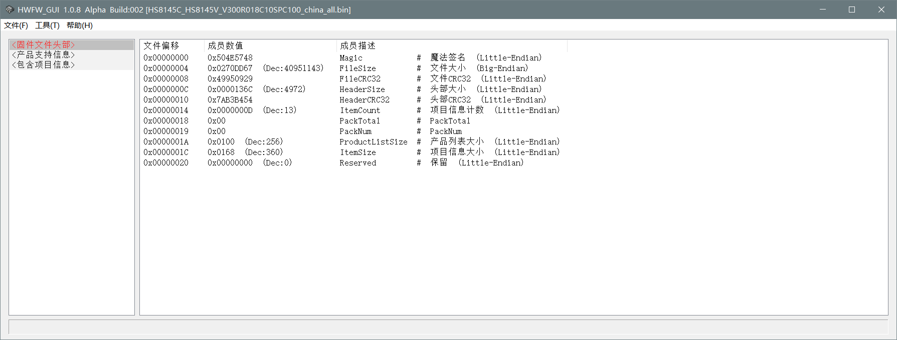
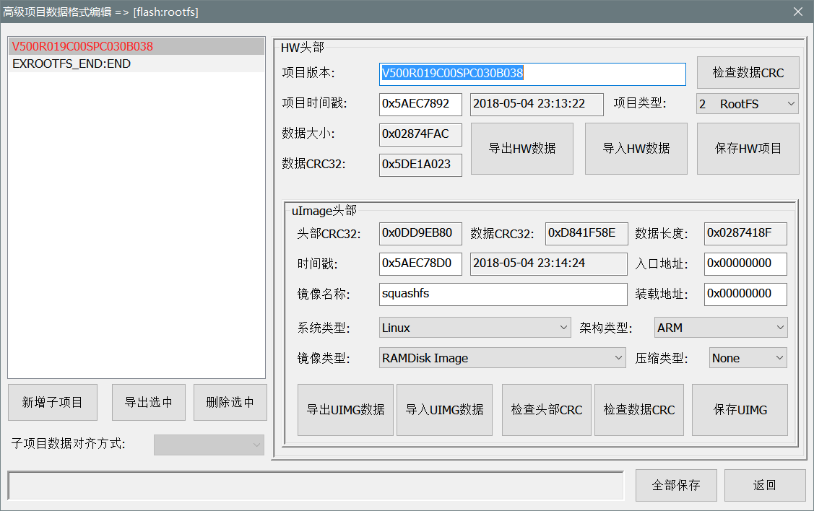

# HWFW_GUI
HuaWei ONT Firmware Editor - GUI

Screenshots
-------

ChangeLog
-------
### 1.0.8 Beta Build 005
- 修改导出子项目时，项目大小的判定规则
- 修复删除子项目时崩溃的问题

### 1.0.8 Alpha Build 002
- 增加编辑产品列表功能
- 增加对R018, R019的子项目解析支持
- 增加对V5固件的子项目对齐支持
- Bug修复

### 1.0.4 Alpha Build 001
- 增加浏览支持的产品型号功能

### 1.0.3 Alpha Build 003
- 增加高级数据格式的编辑功能
- 细节修复
- 代码缩进优化

Donate
-------
如果本软件对你有帮助，请考虑捐赠作者，以支持其继续开发！  
If the software is helpful to you, please consider donating the author to support its continued development!

License
-------

Copyright (C) 2019 csersoft

This program is free software: you can redistribute it and/or modify
it under the terms of the GNU General Public License as published by
the Free Software Foundation, either version 3 of the License, or
(at your option) any later version.

This program is distributed in the hope that it will be useful,
but WITHOUT ANY WARRANTY; without even the implied warranty of
MERCHANTABILITY or FITNESS FOR A PARTICULAR PURPOSE.  See the
GNU General Public License for more details.

You should have received a copy of the GNU General Public License
along with this program.  If not, see <http://www.gnu.org/licenses/>.
